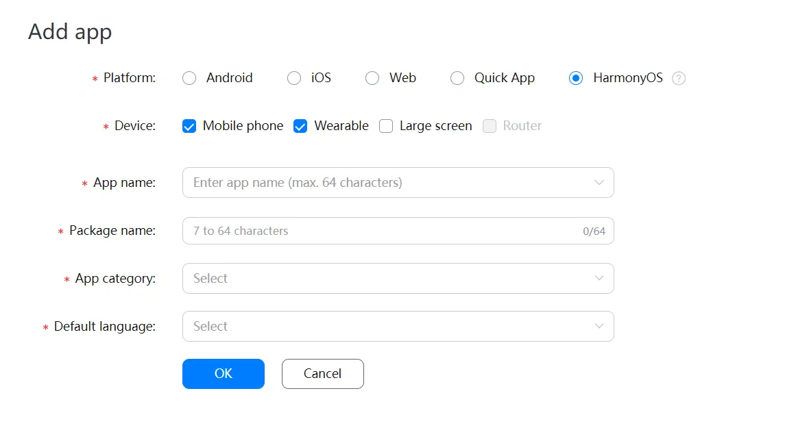
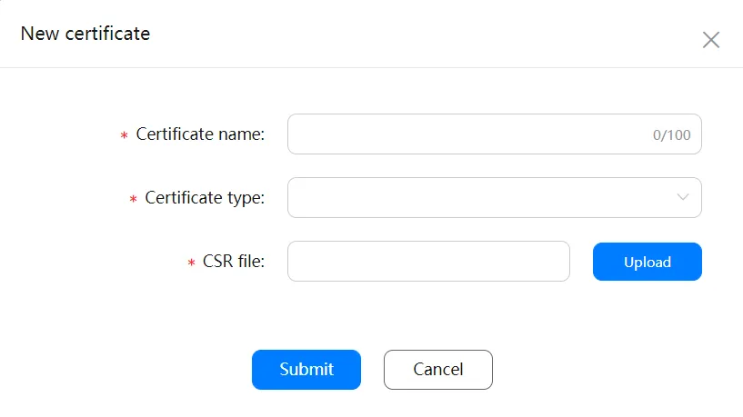
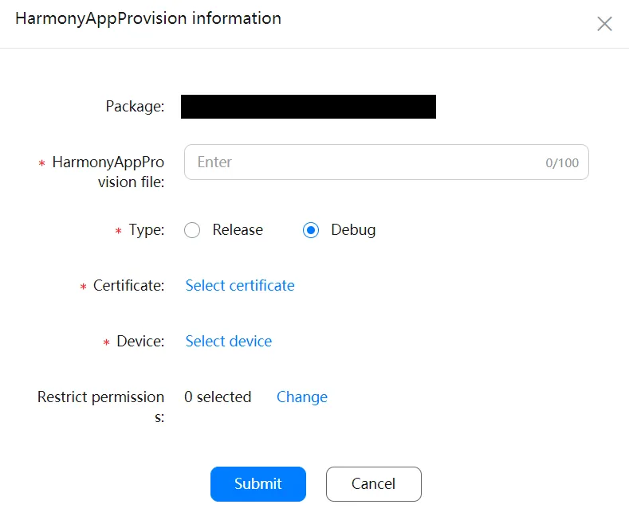
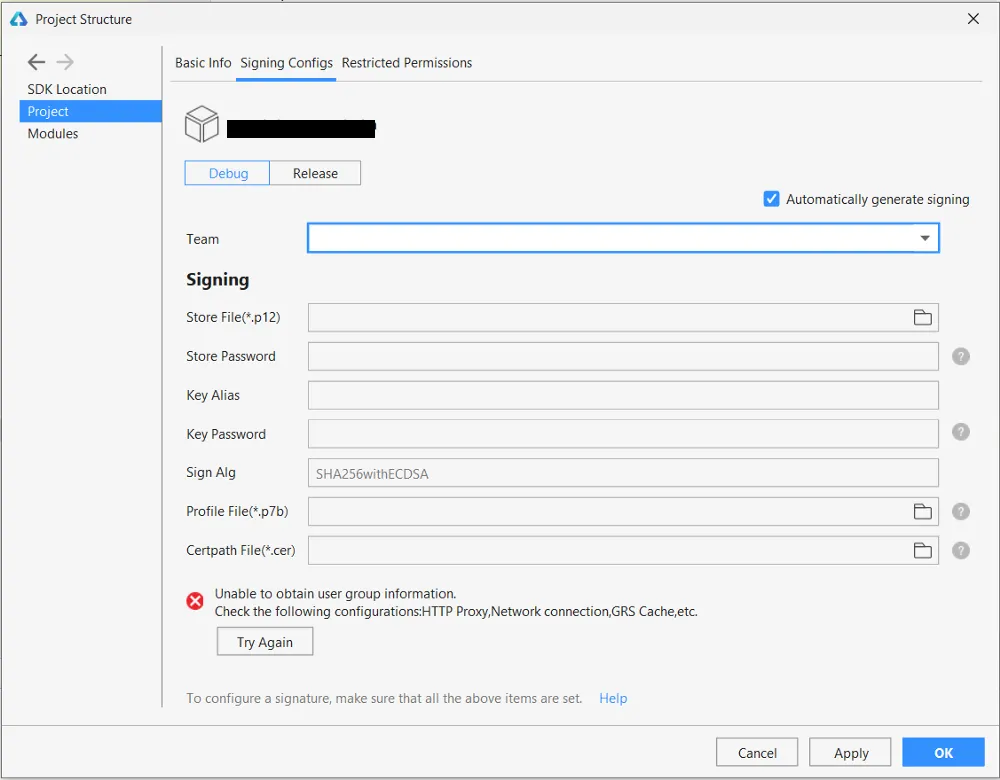
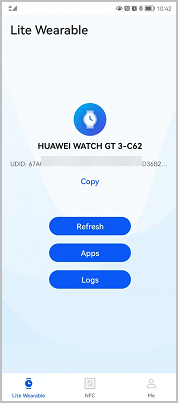

# Huawei Harmony OS Integration Guide

## Prerequisites
- Huawei Developer Account (not required if you don't plan to publish to AppGallery)
- Laptop
- Android Phone

## Steps

1. **Register as a Developer**
    - Register as a developer and complete identity verification. Refer to [Registering a HUAWEI ID and Applying for the HUAWEI ID Service](https://developer.huawei.com/consumer/en/doc/development/connectivity-Guides/registering-applying-account-0000001050818011) for details.

2. **Install HUAWEI DevEco Studio**
    - Download and install HUAWEI DevEco Studio from [here](https://docs.openharmony.cn/pages/v4.1/zh-cn/release-notes/OpenHarmony-v4.1-release.md).
      

3. **Generate Key and CSR**
    - Generate a Key Store and a CSR in DevEco Studio by navigating to `Build > Generate Key and CSR`.
      
    - Follow the steps to create the files. Both files will appear under your project folder.

4. **Create a Harmony App**
    - Create a Harmony app in the App Gallery Connect Console under the project you created in step 1.

5. **Register Your Wearable Device**
    - Register your wearable device in the App Gallery Connect Console by navigating to `Users and Permissions > Device Management > Add Device`.
    - You will need the name, type, and UDID of the device. To find the UDID:
        - [Download](https://drive.google.com/file/d/1PbRE7P_M1xoFDBtf70smyKHAS7Ib52b6/view?usp=sharing) and install HUAWEI DevEco Assistant and HUAWEI Health from AppGallery on your Huawei phone.
        - Open HUAWEI DevEco Assistant and tap the Lite Wearable tab.
        - Tap Connect. This will open HUAWEI Health.
        - In HUAWEI Health, tap the Devices tab, then tap Add.
        - Tap Smart Watch and select a watch model to connect to.
        - Tap PAIR and follow the instructions. The watch model and UDID will be displayed on the HUAWEI DevEco Assistant screen. Tap Copy to copy the UDID to the clipboard.
          

6. **Create a Certificate in the Console**
    - In the App Gallery Connect Console, navigate to `Users and Permissions > Certificate Management > New Certificate`.
    - Enter a name, type, and upload your CSR file generated in Step 3. Download the certificate for later use.
      

7. **Create an HAP Provision Profile**
    - Navigate to `My Projects > Harmony OS Services > HAP Provision Profile > Add` in the App Gallery Connect Console.
    - Choose debug instead of release, select the necessary permissions, and click Submit. Download the `.p7b` file generated.
      

8. **Register the Signing Configurations**
    - In DevEco Studio, select `File > Project Structure > Project > Signing Configs`.
    - In the debug section, check the `Automatically generate signing` checkbox. Optionally, generate a signing config for Release as well.
    - Upload your `.cer` and `.p7b` files downloaded from the Console.

9. **Build HAP and Run Your Project**
    - In DevEco Studio, navigate to `Build > Build Hap(s) App(s) > Build Hap(s)`.
    - After a successful build, the signed and unsigned HAP files will be available under `Entry > Build > Outputs > Hap > Debug`.
    - Transfer the HAP file to your phone, then to your wearable device to run it.

For a detailed guide on the development process, refer to [this Medium article](https://medium.com/huawei-developers/harmony-os-prepare-your-lite-wearable-project-for-integration-b4daaa9df67e) or the [Huawei Developer Documentation](https://developer.huawei.com/consumer/jp/doc/app/agc-help-harmonyos-debugapp-manual-0000001177608893).